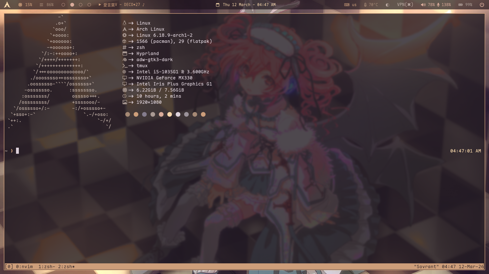
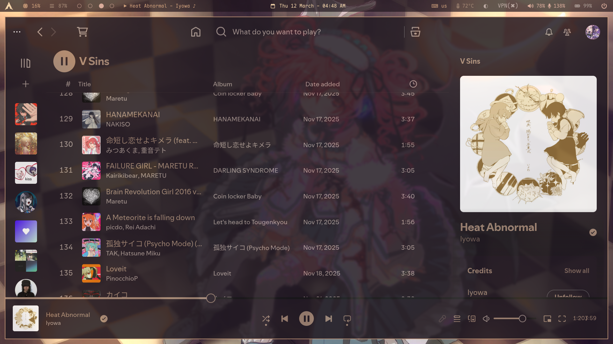
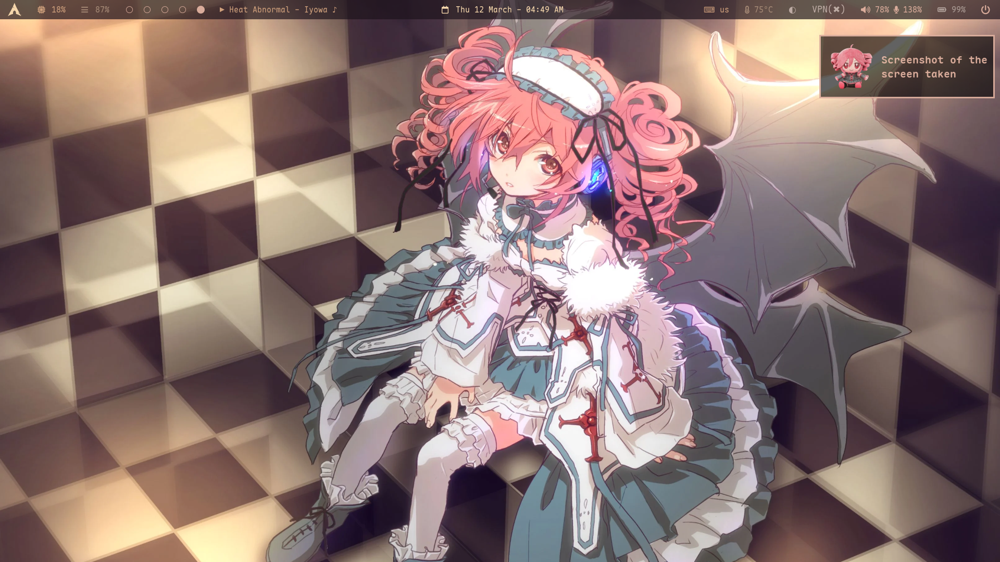
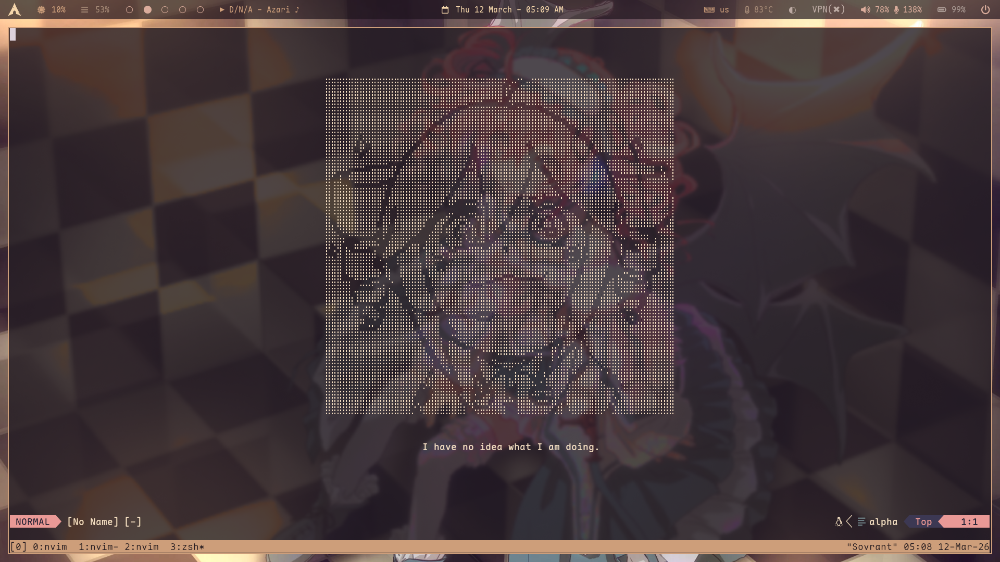

# Ri's Dotfiles

i like teto

## What this dotfiles looks like:

### kitty:

### spicetify = theme: Ziro, color_scheme: blue-dark(changed the color codes):

### dunst (the teto plushie picture can be found in images/systempics):

### nvim:

## feel free to take stuff (wallpaper's in images/systempics)
